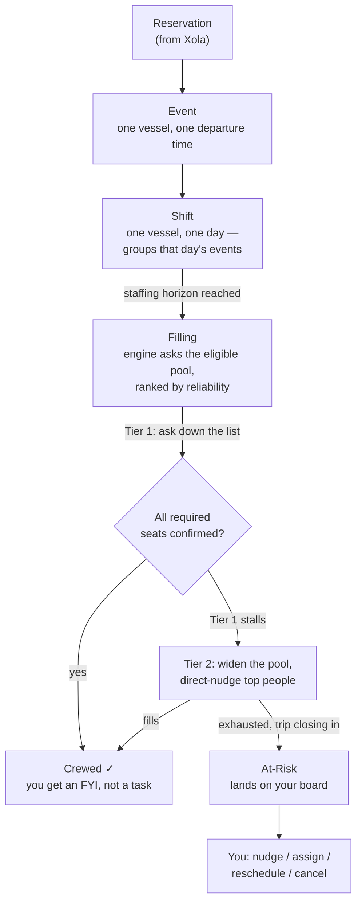
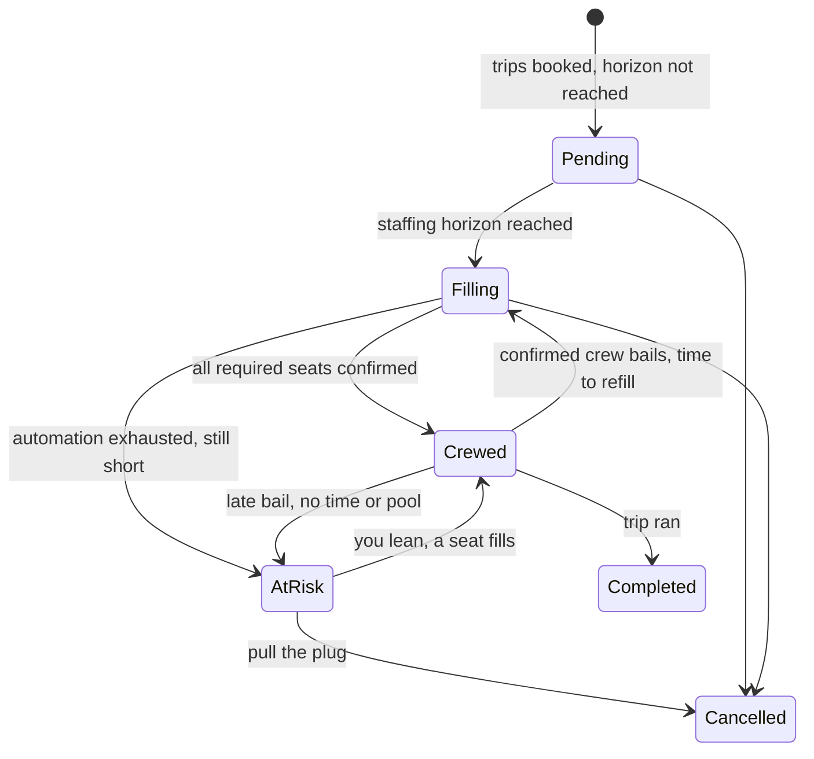
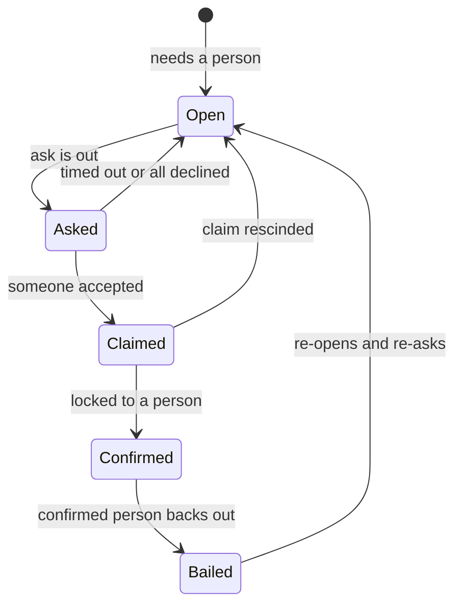

# Muster — Operator Manual

For the operator (Spink). This is the human-facing translation of how Muster works — task-first, not
feature-first. If you want the *why* in full, it lives in [`SPEC.md`](SPEC.md) and
[`DECISIONS.md`](DECISIONS.md); this manual is the short version you actually use.

> **Companion docs:** [`RUNNING.md`](RUNNING.md) is how to start the app and see each screen.
> [`E2E-PILOT-WALKTHROUGH.md`](E2E-PILOT-WALKTHROUGH.md) is a click-by-click dress rehearsal.
> [`DEPLOY.md`](DEPLOY.md) is the hosted go-live runbook. This manual is the mental model that ties
> them together.

---

## What Muster does for you

Xola knows a trip is booked and paid. It has no idea whether anyone will be standing on the dock to
run it. **Muster is the other half:** it turns a week of reservations into shifts, works out who is
legally allowed to crew each one, asks them in order of who's most reliable, and only pulls you in
for the trips it couldn't close on its own. The whole point is to take the *"is Saturday covered?"*
worry out of your head — not to give you another screen to watch.

---

## The one thing to internalize: an empty board is the system working

This is the single idea that makes everything else make sense, and it's the one that trips people up.

**Muster pushes; it does not ask you to pull.** It is not a dashboard you sit in front of. The
At-Risk board shows you *only* the trips the automation genuinely could not crew. So:

- **Empty board = success.** It means every trip is either crewed or still being worked by the
  engine. A blank board is not "nothing loaded" or "something's broken" — it's the machine having
  done its job. You don't need to go check anything.
- **A shift you saw yesterday is gone today = usually success.** If a shift leaves the board, the
  most common reason is the engine put a fresh ask in flight for it — so it's no longer *stuck*,
  it's *being handled*. (See ["A shift vanished"](#a-shift-vanished-from-the-board--where-did-it-go)
  below.)
- **You get summoned, you don't subscribe.** The right amount of time to spend staring at Muster is
  none, until it pings you. When a trip truly needs a human, it lands on the board with the full
  story of what was already tried.

The failure mode this design fights is the *anxiety dashboard* — the wall of yellow that makes you
feel you must babysit it. Muster deliberately refuses to be that. Trust the empty board.

---

## The spine — how a booking becomes a crewed trip

Read top to bottom:

1. **Reservation → Event → Shift.** A Xola booking is a *reservation* attached to an *event* (one
   vessel, one departure). Muster groups all of a vessel's events on the same day into one **shift** —
   that's the unit crew get asked about ("the Hops on Saturday"), not the individual trips.
2. **Pending → Filling.** Far out, a shift sits **Pending**: booked, but it's too early to bother
   anyone. When the **staffing horizon** arrives (a set number of days before the trip), the shift
   flips to **Filling** and the engine starts asking.
3. **The engine asks (Tiers 1–2).** It asks the eligible crew — only people whose credentials are
   valid on the trip date and who hold the right rating ever get asked — in **reliability order**.
   This runs with no involvement from you.
4. **Crewed, or At-Risk.** If every required seat gets confirmed, the shift goes **Crewed** (green;
   you get an FYI at most). If the automation runs out of people to ask and the trip is closing in,
   the shift goes **At-Risk** — and *that* is when it lands on your board.

The last-minute booking just falls out of this: a customer books Saturday on Friday night, it's
already inside the staffing horizon, so the shift is born straight into **Filling**, Tier 1 fires,
the first eligible captain and mate accept, and it's **Crewed** before you'd have noticed. No feature
for it — it's the same organs running in sequence.

---

## Your surfaces

In the pilot you have four surfaces — three off the `/admin` hub (board, outbox, import), plus a
shift's **cockpit** you open by drilling into a board row. You sign in once with the magic link you
were sent (in dev: open `/crew/dev-link?admin=spink` and tap the green button). You do **not** need a
password.

### 1. The At-Risk board — `/admin/at-risk`

Your worklist. **The only trips here are ones the automation couldn't close**, most-urgent first.

- **Empty** → the calm "Nothing needs you right now" card. That's the win state. Stop here.
- **A row** carries everything you need to act without opening it:
  - A **flag pill** naming the problem: *Lacking crew · late bail* (someone confirmed then backed
    out — red), *Lacking crew · none eligible* / *no takers* (never filled — amber), *Credential
    lapse* (a confirmed crew's ticket expires before the trip).
  - The vessel, date, and each departure time.
  - A red countdown when the trip is close.
  - A **"System tried"** trail — who was asked, who declined, who went silent (silent is shown in
    red; that's the one you care about), whether the pool was widened.
  - **"Still available"** — the people left to lean on, each with a **↗ Nudge** button.
- **Reschedule / Cancel** are shown but disabled — those cascades (refunds, customer notice) are
  parked with payments. **Handle reschedule and cancel by phone for now.**
- The header tally (e.g. *"3 shifts need attention · 1 late bail"*) is the at-a-glance count.

### 2. A shift's cockpit — `/admin/shift/<id>`

Click a board row (or **Assignment ↗**) to open one shift in detail. This is "monitor by default,
controls on demand."

- **Header:** the trips and pax, a **departs in** countdown, the staffing horizon, and a **fills-by
  deadline** (red and *overdue* once it passes — which is normal for a shift that's exhausted its
  pool; it boards *after* fills-by).
- **One card per required seat**, showing its state (Open / Asked / Claimed / Confirmed / Bailed) and
  the **ranked eligible pool**. Silent and declined people look different on purpose.
- **Actions appear only where they'll work** (the engine never shows you a button it would refuse):
  - On a **Claimed** seat (someone said yes, awaiting your blessing): **Confirm into seat**.
  - On an **Open/Bailed** seat: **Ask to fill** an available person, or **↗ Nudge** someone who
    declined/went silent.
  - **Manual override → Place <name>** — skips the checks and confirms someone outright. Your
    big red button for "just put Marisol on it."
  - On a **Confirmed** seat: **Remove** (wrong person, no penalty) or **Bailed** (they actually
    backed out — logs a late bail against their record). Either reopens and re-asks.
- **Trending at-risk →** (bottom) opens, behind a deliberate click, the shifts that are *trending*
  toward trouble but aren't on the board yet. This is intentionally not on the board — it's there
  when you go looking, never glowing at you.

### 3. The Outbox — `/admin/outbox`

**The pilot's send mechanism.** Muster doesn't text crew automatically yet (that's a later swap).
Instead, when the engine fires an ask, it lands here as a card, and **you send the text from your own
phone** with one tap:

- Each card shows who to ask, for which trip, and why (1st ask, 2nd ask, who declined).
- Tap **Send** → on a phone, your Messages app opens pre-filled with the ask and a magic link for the
  crew member. (On a desktop browser the link may do nothing — that's the computer not having
  Messages, not a bug.) The button flips to **Resend / awaiting reply**.
- Cards addressed to **you** (a *you* pill) have inline **In / Out** buttons — no text to send,
  you're answering your own ask.
- **Dismiss** (the small link under a card) clears it from your worklist without sending — for an ask
  you've handled off-system or don't want to relay. The card goes, but the **ask stays live**: it
  times out on its own (~2h), and the engine may surface a fresh card for the *next* crew member in
  the meantime. So a new card after a dismiss isn't a failure — it's the engine moving on.
- Best done on your phone. The header counts how many asks still need you.

### 4. Import — `/admin/import`

Load the week's Xola reservations: upload the export, preview and validate it, import. That builds the
events and shifts the engine then works. This is how real data gets in for the crew weekend.

---

## Playbook — how do I…

### Crew the weekend (the normal flow)

1. **Import** the week's Xola reservations (`/admin/import`).
2. **Let it run.** As each shift crosses its staffing horizon, the engine asks the eligible crew in
   reliability order. In the pilot, those asks pile up in the **Outbox** — work through it, tapping
   **Send** on each, so the texts actually go out from your phone.
3. **Glance at the board** when you have a minute. Most of the time it's empty or nearly so — that's
   the engine closing trips without you.
4. **Act only on what lands.** A trip on the board is one the automation couldn't close. Open it,
   read the "System tried" trail, and lean on someone (or handle it by phone).

That's the whole job: feed it the week, relay the asks, triage the few it can't close.

### Onboard a new crew member

Muster doesn't add crew from a screen yet — a new person is added to the roster out-of-band (a seed/
import the dev runs), then you set their contact and say hello:

1. **Make sure their phone + email are right.** Wrong phone = no texts; wrong email = login codes never
   match. Fix either with the `db:crew` CLI (see the **break-glass** section of `DEPLOY.md`):
   `db:crew -- list` to find their id, `db:crew -- set <id> --phone=+1… --email=…`.
2. **Send them a hello** so the first Muster text isn't a mystery. Text this (swap the name + your
   company), or send it to everyone new via **`/admin/messages`** → all-staff:

   > Hi <NAME> — this is <COMPANY>'s crew scheduler, **Muster**. When there's a trip for you, you'll
   > get a text here; tap **In** or **Out**. Save this number. How it works: `https://<your-domain>/crew/help`

3. **How they sign in.** The normal front door is a **code**: they open the app, enter their email, and
   get a 6-digit code to sign in (a sign-in lasts ~14 days). Two shortcuts skip the code — the **link in an
   ask text** signs them in *and* opens the ask in one tap, and `db:mint -- --crew=<id>` mints a one-off
   sign-in link you can hand someone who's stuck. So a new crew member's first sign-in is usually just
   tapping their first ask; the code is how they get back in later.

Point crew at **`docs/CREW_QUICKSTART.md`** (the same content as the in-app **How Muster works** page,
`/crew/help`) — it's printable/pasteable.

### The board is empty — is that bad?

**No. It's the best case.** An empty board means every trip is crewed or still being actively worked
by the engine. Muster only surfaces trips that genuinely need a human, so "nothing here" literally
means "nothing needs you." Don't go hunting for work it isn't showing you — if it wanted you, it
would have put a row on the board.

### A shift vanished from the board — where did it go?

**First, how far out is the trip?** Within ~2 days (the fills-by deadline), an uncrewed shift does
**not** vanish like this — it stays on the board even with an ask in flight, and nudging someone no
longer hides it (DEC-065). Near the dock you always see what isn't crewed.

For a trip **more than ~2 days out**, a vanish is almost always **the engine working**, not a dropped
ball:

> The shift had run out of *immediately* available crew, so it showed up. Then the engine widened the
> pool and **put a fresh ask in flight** to someone newly eligible. A far-off shift with a live ask out
> is no longer *stuck* — so it correctly leaves the board while that person decides.

To confirm: open the shift's **cockpit** (`/admin/shift/<id>`). You'll see the seat is **Asked** and
the pool reads **awaiting reply**. The shift is being handled; it'll come back to the board only if
that ask also fails — or as soon as the trip crosses inside the ~2-day deadline.

### Someone bailed

What happens depends on *how late* the bail is — that's the whole signal:

- **Early bail (time to refill):** the seat reopens and the engine **re-asks automatically**. The
  shift drops back to **Filling** and works itself. You may never see it. Nothing for you to do.
- **Late bail (no time, or nobody left to ask):** the shift goes **At-Risk** and lands on your board
  with a red *Lacking crew · late bail* pill, pinned to the top. This is the 11pm-bail case — open
  it, lean on whoever's left (**↗ Nudge**), or handle by phone.

Either way the bail is logged against that crew member's reliability (scaled by lateness), so it
quietly affects where they sit in the ask queue next time. You don't have to do anything to "punish"
a bail — the system just stops compensating for it.

### A late booking landed on a shift I'd already settled

If a booking lands or changes *after* a shift was reviewed/locked, the shift's cockpit shows an amber
notice — *"A booking changed since this shift was last reviewed — take another look."* — a heads-up
that the picture moved under you (a guest was added, a trip shifted). Re-open it and check. (In the pilot this is a derived flag — there's no
manual "lock" button wired into the cockpit yet; the notice is the signal to re-check.)

### Nobody's answering a shift

Open its cockpit and read the pool:

- **People who declined or went silent** → **↗ Nudge** them (a direct "I need you on this"). Silence
  is the one to chase — a declined "no" is a real answer; a silent person just hasn't replied.
- **Someone available who wasn't asked yet** → **Ask to fill**.
- **You know who you want, checks be damned** → **Manual override → Place <name>**.
- **Truly nobody left** → the row says so ("nobody left in the eligible pool — this is the reschedule
  / cancel"). That's a phone call: reschedule or cancel with the customer directly.

### Nudge vs Assign — what's the difference?

- **Nudge** = a direct *ask* to one person ("I need you on this"). They still have to say yes. Use it
  to lean on someone the broadcast missed or who went quiet.
- **Assign / Place (override)** = you *put them on it*. Manual override confirms them outright,
  skipping the eligibility checks. Use it when you've decided and don't need their reply.

Rule of thumb: **Nudge** when you're still asking; **Place** when you've decided.

---

## The concepts behind the buttons

### Reliability order (why some crew get asked first)

Every crew member has a reliability score that sets **ask priority** — nothing more. It's not a gate
(credentials gate; the score only orders *who gets asked first*) and it's not a grade. Good actors
rise, see more shifts, and claim first; flakes drift down and naturally get asked less. Two rules
make it honest:

- **Declining is fine; going silent is the sin.** A fast "no" costs nothing — it's a real answer.
  Only *ignoring* an ask hurts the score. (Penalize a quick no and you teach people to go silent,
  which kills the signal you actually need.)
- **The lateness of a bail is what matters, not the bail.** A cancel a week out is cheap; an 11pm
  bail is expensive; a no-show is the worst.

**Your thumb on the scale:** Muster supports a per-person **boost** or **floor** ("this veteran never
ranks below X") — how you carry judgment a flat score can't (it would forget a four-year veteran
after a slow couple of months). *In the pilot this is set on the crew record, so the knob arrives
with the roster screen in a later phase (see [what's not in the pilot yet](#whats-not-in-the-pilot-yet)).*
Crew see *their own* standing (plain and individual — "answered fast · showed 8/8 · one late bail"),
never a leaderboard.

### The tiers (what runs without you, and when you're pulled in)

- **Tier 1 — autonomous.** Ask the eligible pool in order, accept down the list until the required
  seats are confirmed. The normal Saturday. No you.
- **Tier 2 — semi-autonomous.** Tier 1 stalled, so widen the pool and direct-nudge the strong people.
  Still no you.
- **Tier 3 — human.** Automation is out of options and the trip is closing in. *Now* it's At-Risk and
  on your board, with the full record of what was tried.

You only ever exist at Tier 3. Tiers 1–2 are the point.

### Call time vs departure time

On the crew member's shift card these are shown as two distinct, labeled values — **Shift Start** (the
report/call time, when they need to be on the dock) and **First departure** (when the boat actually
leaves), plus a **Shift End**. This is the #1 dock confusion ("I thought 3pm meant *leave* at 3"), so
the card never lets them blur together. You don't set these — they derive from the trip times.

### Silent vs declined

Everywhere crew responses show up (the board trail, the cockpit pool), a **declined** person and a
**silent** person look different, and silence gets the louder treatment. A "no" is information you can
act on; silence is the gap that bites you at 11pm. The product treats it as the thing worth chasing.

---

## The two state machines

You rarely need these, but when you want the full picture, here's the machinery the screens render.
Derive the **shift** state from its **seats**.

### Shift

- **Pending** — booked, too early to staff. **Filling** — being worked (Tiers 1–2), whether zero or
  some seats are filled. **Crewed** — all required seats confirmed (green). **At-Risk** — human-only;
  on your board. **Completed** — trip ran; feeds reliability. **Cancelled** — killed.
- A "locked" Crewed shift is never *truly* locked until the trip runs — a late bail can drop it to
  At-Risk. That's the whole reason the board exists.

### Seat

- **Open** → eligible pool computed. **Asked** → ask is out, awaiting reply. **Claimed** → someone
  accepted (tentative). **Confirmed** → locked to a person. **Bailed** → a confirmed person backed
  out; the seat reopens and re-asks.

---

## Glossary

| Term | What it means |
|------|---------------|
| **Reservation** | A customer booking (from Xola): who, party size, contact. |
| **Event** | One vessel, one departure time. A reservation attaches to an event. |
| **Shift** | One vessel, one day — groups that day's events. The unit crew get asked about. |
| **Seat** | One crew position on a shift (e.g. the captain seat). Has its own state. |
| **Ask** | A request to one crew member to take a seat. Doubles as a reliability signal. |
| **Eligible pool** | The crew legally allowed to take a seat — right rating, credentials valid on the trip date. Only these get asked. |
| **Reliability order** | The order the engine asks the pool in — most reliable first. Ranking, not a gate. |
| **Staffing horizon** | How many days before a trip the engine starts seeking crew. Before it, a shift is Pending. |
| **Fills-by deadline** | When a shift should be crewed by; once past, it boards if still short. |
| **At-Risk** | A shift the automation couldn't close — the only thing on your board. |
| **Nudge** | A direct ask to one person. They still reply. |
| **Override / Place** | You put someone on a seat outright, skipping checks. |
| **Tiers 1–3** | Degrees of automation: 1 autonomous, 2 escalation, 3 you. |

---

## What's not in the pilot yet

So nothing surprises you — these are deliberate omissions, not missing pieces:

- **No roster / event-admin / shift-builder screens.** Crew, events, and shifts come in via
  **Import** (or dev seeds). Editing them through a UI lands in a later phase.
- **No automatic texting.** Muster does not send crew texts on its own yet. Asks land in the
  **Outbox** and you relay them from your phone (the pilot channel). Twilio auto-send is a later swap.
- **No reschedule / cancel cascades.** Those buttons are disabled. Handle reschedule and cancel **by
  phone** with the customer for now (they're parked with payments).
- **No customer-facing anything.** No guest portal, no payments, no booking feed — Xola still owns
  the customer side. Muster is the crew half only.
- **One operator.** The pilot assumes you're the only operator. Multi-operator handling comes later.

This is a **hosted pilot, not production.** It's enough to run a real weekend — which is exactly its
job.
